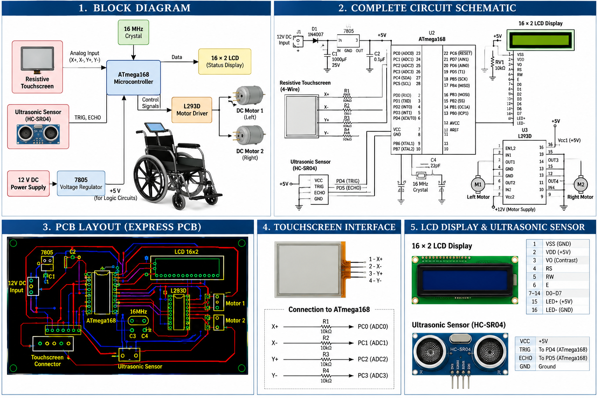

# Touch Screen Controlled Wheelchair

## Bachelor of Technology Capstone Project

**Discipline:** Electronics and Communication Engineering  
**Project:** Touch Screen Controlled Wheelchair  
**Project Type:** Undergraduate Engineering Capstone  
**Period:** 2010–2014  
**Institution:** Sam Higginbottom Institute of Agriculture, Technology and Sciences (SHIATS), Allahabad, India  
**Author:** Swati Clarice Xalxo

---

## Overview

The Touch Screen Controlled Wheelchair was an undergraduate engineering capstone project involving the design and implementation of a microcontroller-based wheelchair control system.

The system uses a **resistive touchscreen as the user input interface**. Touch coordinates are processed by an **ATmega168 microcontroller**, which controls two DC motors through an **L293D motor-driver IC**.

The project combined embedded electronics, microcontroller interfacing, motor control, touchscreen interfacing, LCD interfacing, circuit design and PCB layout.

---

## System Overview



The technical overview illustrates the major hardware and control elements documented in the project, including the ATmega168 microcontroller, resistive touchscreen, L293D motor driver, DC motors, LCD, power regulation and associated interfaces.

---

## Main Components

The documented project used:

- ATmega168 microcontroller
- Resistive touchscreen
- L293D motor-driver IC
- Two 12 V DC motors
- 16×2 LCD
- 16 MHz crystal oscillator
- 7805 voltage regulator
- Resistors
- Capacitors
- Diodes
- Ultrasonic sensor
- Power supply circuitry

---

## Technical Work

The project documentation covers the following engineering areas:

- Microcontroller configuration
- Embedded C programming
- Digital I/O
- ADC-based touchscreen interfacing
- Touch coordinate detection
- Motor-driver interfacing
- DC motor direction control
- LCD interfacing
- Ultrasonic sensor interfacing
- Circuit and schematic design
- PCB layout
- PCB fabrication

---

## Embedded Control

The documented program implements motor-control operations including:

- Forward movement
- Reverse movement
- Individual motor control
- Direction changes
- Stop
- Parking
- Unparking

Example motor-control values documented in the project include:

```c
P0 = 0x05;   // Move forward
P0 = 0x0A;   // Move backward
P0 = 0x00;   // Stop
