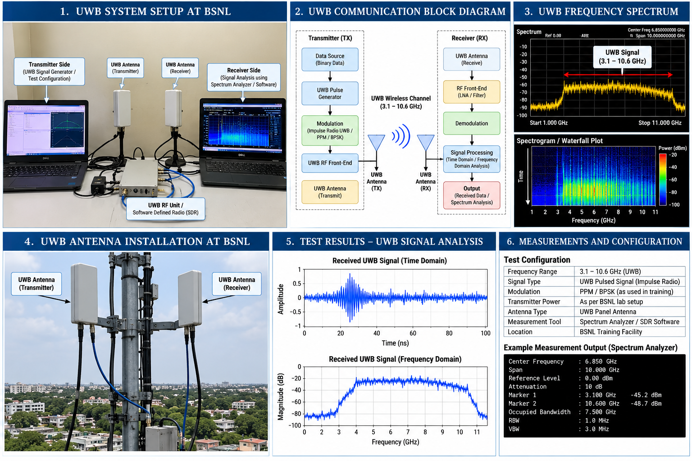

# BSNL – Ultra-Wideband Technology and Its Applications

## Individual Telecommunications Training Assignment

**Organisation:** Bharat Sanchar Nigam Limited (BSNL)  
**Training Centre:** Advanced Regional Telecom Training Centre, Ranchi  
**Assignment:** Ultra-Wideband Technology and Its Applications  
**Date:** July 2013  
**Type:** Individual Technical Assignment  
**Author:** Swati Clarice Xalxo

---

## Overview

This individual technical assignment was completed during telecommunications training at the **BSNL Advanced Regional Telecom Training Centre, Ranchi**.

The assignment investigated **Ultra-Wideband (UWB) technology**, its operating principles and its telecommunications applications.

The work demonstrates early technical exposure to wireless communication systems and telecommunications technologies through independent technical study and engineering documentation.

---

## Technical Areas

- Ultra-Wideband (UWB) technology
- Wireless communication
- Telecommunications systems
- UWB applications
- Radio-frequency communication concepts
- Technical research
- Engineering documentation
- Telecommunications technology analysis

---

## Skills Demonstrated

### Telecommunications

- Understanding of telecommunications technology concepts
- Study of wireless communication technologies
- Investigation of UWB technology and applications
- Technical interpretation of communication-system concepts

### Technical Research

- Independent investigation of a telecommunications technology
- Review and organisation of technical information
- Translation of technical concepts into structured documentation
- Preparation of an individual engineering assignment

### Engineering Documentation

- Technical report preparation
- Structured presentation of telecommunications concepts
- Use of diagrams, technical figures and supporting material
- Engineering-focused written communication

---

## Engineering Relevance

The assignment provides evidence of **telecommunications and wireless-communication technical exposure** developed during formal training with BSNL.

It is particularly relevant to engineering roles involving:

- Telecommunications
- Wireless communications
- Network technology
- RF and radio systems
- Communication infrastructure
- Technical engineering analysis

This assignment represents **technical training and academic work**, rather than commercial telecommunications employment.

---

## Evidence

Supporting project material is organised within this repository.

### Technical Overview

The supporting material documents the UWB technology topic studied during the BSNL training program.

Additional supporting documents are organised into:

- `assignment/`
- `evidence/`

---

## Training Context

**Organisation:** Bharat Sanchar Nigam Limited (BSNL)  
**Training Centre:** Advanced Regional Telecom Training Centre, Ranchi  
**Location:** Ranchi, India  
**Training Period:** 2013

This was an **individual technical assignment** completed as part of telecommunications training.

---

## Skills Relevant to My Engineering Portfolio

This project supports evidence of:

- Telecommunications engineering
- Wireless communication
- UWB technology
- Technical research
- Engineering documentation
- Independent technical study
- Communication-systems knowledge

---

## Author

**Swati Clarice Xalxo**

Electronics & Communication Engineering  
Telecommunications Engineering  
Engineering Management
